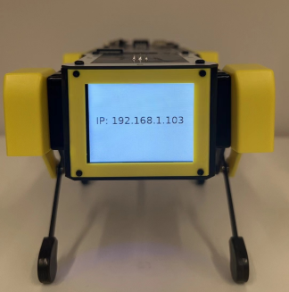
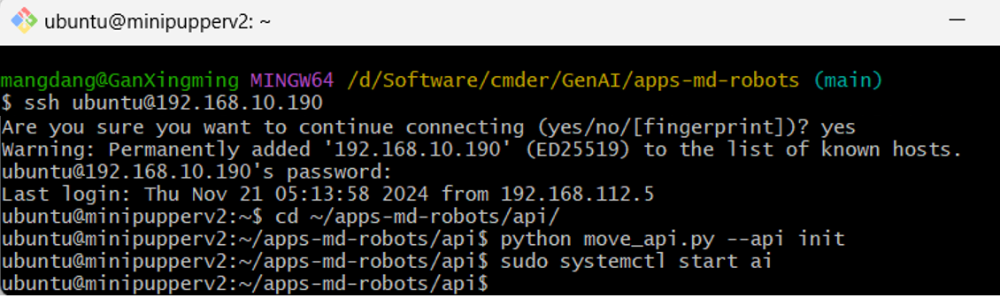
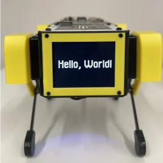
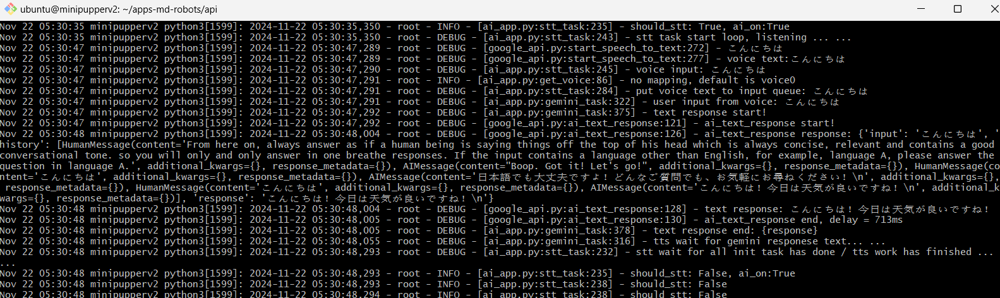
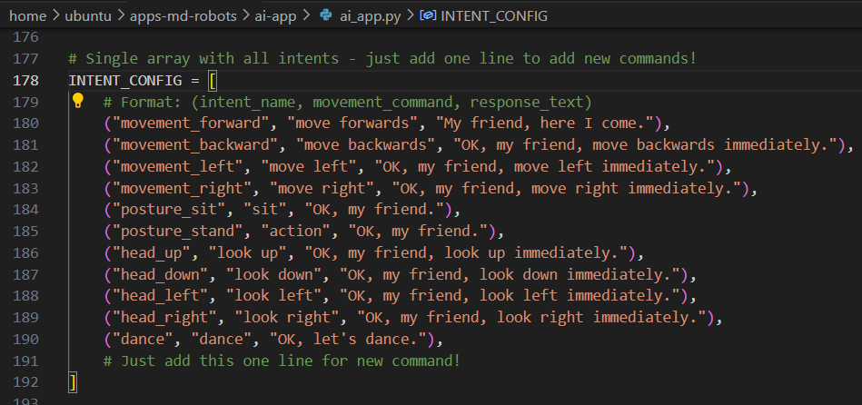

# AI Application Demos of MD Robot Starter Kits
[MangDang](https://mangdang.store/) Online channel: [Discord](https://discord.gg/xJdt3dHBVw), [FaceBook](https://www.facebook.com/groups/716473723088464), [YouTube](https://www.youtube.com/channel/UCqHWYGXmnoO7VWHmENje3ug/featured), [Twitter](https://twitter.com/LeggedRobot)

MD Robot Starter Kits: Unlock your AI Dream Job.
Make robotics easier for schools, homeschool families, enthusiasts and beyond.

- Generative AI: Support ChatGPT, Gemini, and Claude
- ROS: support ROS2(Humble) SLAM & Navigation robot dog at low-cost price
- OpenCV: support OpenCV official OAK-D-Lite 3D camera module and single MIPI camera
- Open-source: DIY and customize what you want.
- Raspberry Pi: It’s super expandable and endorsed by Raspberry Pi.

# Overview

The AI applications can be run on MD Robot Starter Kits, including Mini Pupper and Mini Pupper 2.
Please click the picture and refer to the demo video.

[](https://www.youtube.com/watch?v=mIDuIZCevIg)


[](https://www.youtube.com/watch?v=bvH-lA1IHig)

# Software Installation

## Solution 1: Flash the pre-built image

You can download our pre-built images and try the AI functions quickly.
- Step 1: Download the pre-built base image file(like * AI *.img),  [Mini Pupper 2](https://drive.google.com/drive/folders/1_HNbIb2RDmHpwECjqiVlkylvU19BSfOh?usp=sharing) or [Mini Pupper 1](https://drive.google.com/drive/folders/1jJm_6qBIYGGp2dpZNm668D0eH1JpfCqn?usp=sharing)
- Step 2: Flash the image into the SD card.

## Solution 2: Build by Self

### Preparation

Please make sure Mini Pupper can walk first by the webserver. 

- Install the BSP package, [Mini Pupper 2](https://github.com/mangdangroboticsclub/mini_pupper_2_bsp) or [Mini Pupper 1](https://github.com/mangdangroboticsclub/mini_pupper_bsp)

- Install the [quadruped repo](https://github.com/mangdangroboticsclub/StanfordQuadruped )


### Install

For the video guide, please click the picture and refer to the demo video.

[](https://www.youtube.com/watch?v=1AkhJi2o8rM)


Clone this repo.
```
cd ~
git clone https://github.com/mangdangroboticsclub/apps-md-robots
cd apps-md-robots
```

Copy your google cloud API key file to your robot and set your google cloud API key file location in .env file.
 
```
cd ~/apps-md-robots/
# copy a template file to edit
cp env.sample .env

# Edit .env file, set your key path in .env file,
# like: API_KEY_PATH=/home/ubuntu/xxxx.josn 
vim .env
```

Install the dependency libs.

```
cd ~/apps-md-robots/ai-app/
sudo apt-get install -y python3-pyaudio
sudo apt-get install -y libgl1
sudo pip install -r requirements.txt 

sudo cp ai.service /etc/systemd/system/ai.service
```

# Run

## Run by Webserver
run app demos.

- Step 0: After your robot boot up and IP address shows on the robot LCD screen, point a web browser to x.x.x.x:8080 where x.x.x.x is the IP address of your mini_pupper, such as, 192.168.1.103:8080



- Step 1: Select "Pupper" option in the left menu, click the “Activate/Deactive” button, robot LCD screen will change to a yellow face.
- Step 1: Select "Settings" option in the left menu, click the “AI On” button, and wait about 10s after robot LCD screen shows "Hello World". 


## Run by Command Line

connect the robot by ssh command.



```
ssh ubuntu@x.x.x.x
# the default password is mangdang
```

run app demos.
 
```
cd ~/apps-md-robots/api/
# Go to movement mode
python move_api.py --api init

# Start the generative AI service
# The display will show "Hello, World!" when it's ready.
sudo systemctl start ai
```




You can check the output when you debug

```
sudo journalctl  -f -u ai
```




If you want to DIY the key words to control the robot by voice, please revise line 262 or line 275.




If you want to test the API, run the following command.
```
cd ~/apps-md-robots/api/
python move_api.py
```

If you want to test the camera module, run the following command.
```
ffmpeg -i /dev/video0 -vf 'scale=320:240' -vframes 1 -an -b:v 500k output.jpg
```